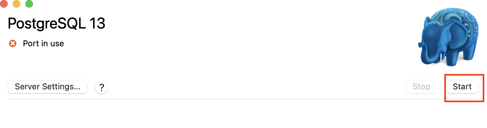
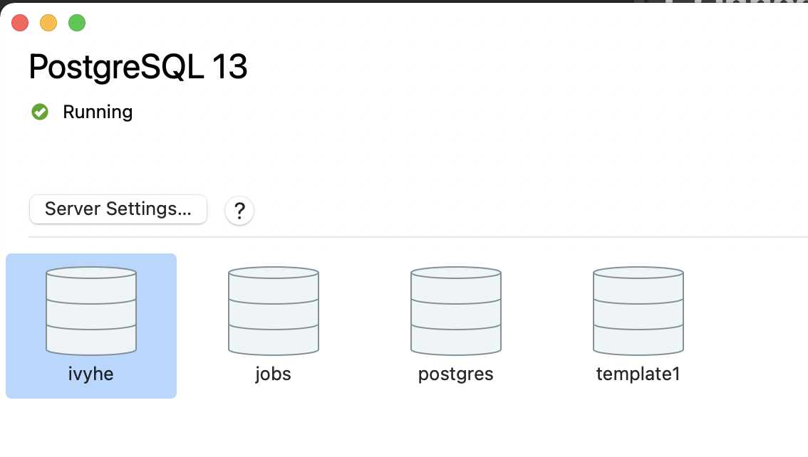
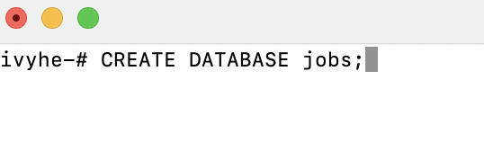

# CS-Students-Job-Searching-App

## Who we are
 - Frontend: Andrea Chan, Sherry Shi
 - Backend: Ivy He, Sara Liu
 
 ---
 
 ## Purpose Of the App
 - Better assist CS students doing their job search 
 - Gather cs job info from several websites and then filter them according to user's preference
 - Customise each user's job searching list
 
 ---
 ## Tech Stack
 - Frontend: React
 - Backend: Java, Spring Boot
 - Database: MySQL, AWS
 
 ---
 ## Design 
 - Frontend
 - Backend
  
 
---
## COnnect to Database
- [Install postgres](https://postgresapp.com/downloads.html)
- Start Postgres
    
- Open Postgres Terminal
    
- Type: `CREATE DATABASE jobs;`
    
